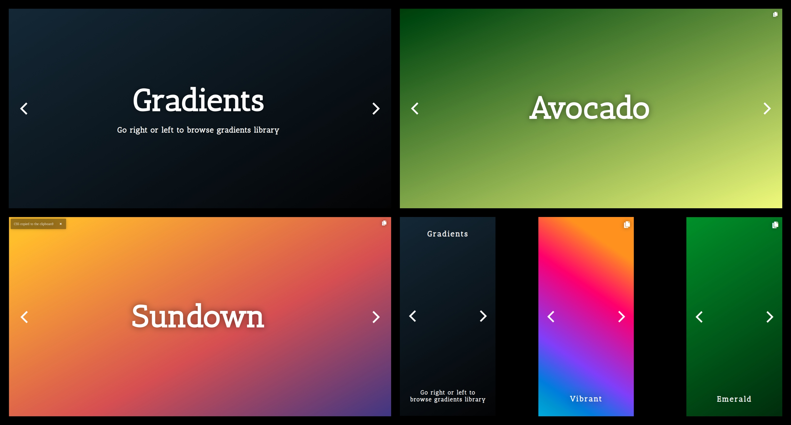

# Gradients

    

Website available [here](https://jakubpawlina.github.io/gradients/).

## Description
Gradients library for UI designing. Choose gradient, copy its CSS code and use it in your project!

## Screenshots


## Contributing
#### Adding gradients
1. Add a gradient to the file ```css/gradients.css```. Here is a basic scheme of the code looks like this:
	```css
	.{name}
	{
		background-color: rgb({0-255}, {0-255}, {0-255});
		background-image: linear-gradient({0-359}deg, rgba({0-255}, {0-255}, {0-255}, {0-1}) {0-100}%, rgba({0-255}, {0-255}, {0-255}, {0-1}) {0-100}%);
	}
	```
2. Add a gradient to ```index.html``` file, as the last element in a div 'gallery'. The code should look like this:
	```html
	<div class="gradient {gradient-name}" id="{gradient-name}">
		<h1>{Displayed Name}</h1>
		<button onclick="copy_to_clipboard('{gradient-name}')" title="Copy CSS to the clipboard!" id="copy">
			<i class="fas fa-copy"></i>
		</button>
	</div>
	```
#### Other contributions
Feel free to suggest your own ideas. This is the magic of the open source!

## License
Project is licensed under the [GPLv3](https://www.gnu.org/licenses/gpl-3.0.html). It regards a project itself - of course, all gradients can be used without any special limitations.

